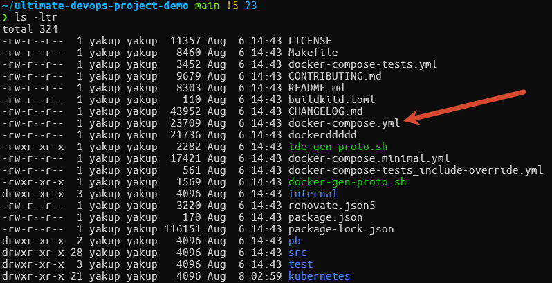
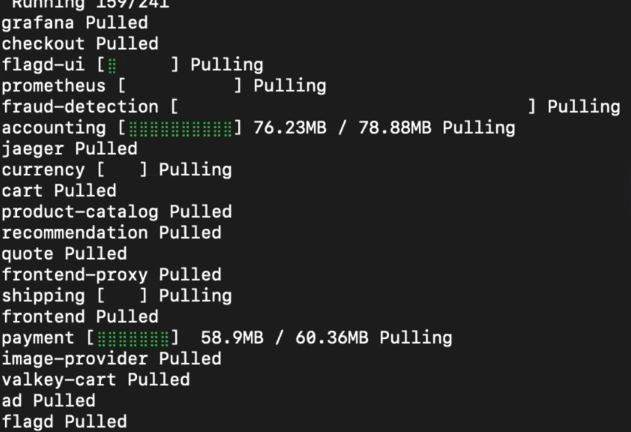
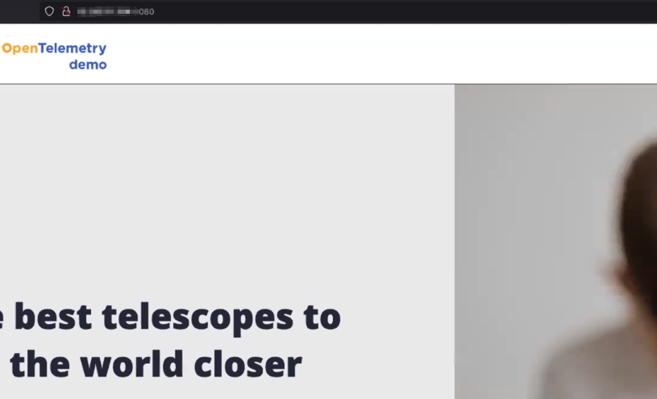

## Run the Project Locally
1. clone the repository to your local machine
```
git clone https://github.com/iam-veeramalla/ultimate-devops-project-demo.git
```


once you run : ```docker compose up ``` it will pull all the images 



- since we don't have disk attached to our EC2 instance you may get a disk space error, easy to fix.
- and then, to be able to access the project from our browser, we have to edit the security group of our EC2 instance and allow inbound rules allowing all the traffic from anywhere, for now.
  
